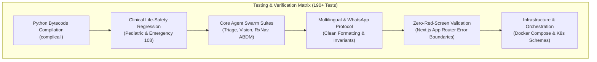
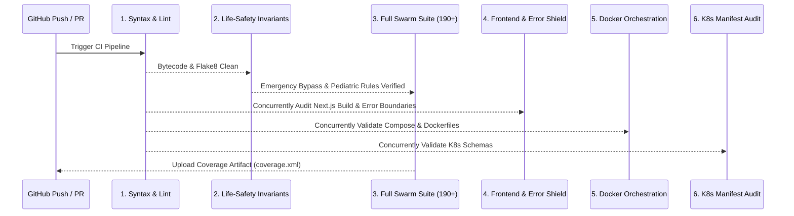
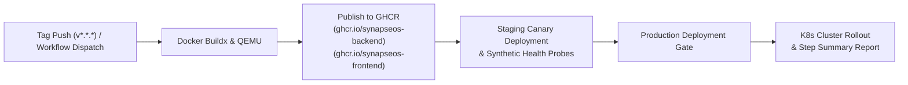

# Automated Testing & CI/CD Pipelines Architecture

[-10b981?style=flat-square&logo=githubactions)](https://github.com/Rachit-Tiwari-7/SYNAPSE-OS/actions)
[](https://github.com/Rachit-Tiwari-7/SYNAPSE-OS/security/code-scanning)
[](https://github.com/Rachit-Tiwari-7/SYNAPSE-OS)

This document details the enterprise-grade automated testing matrix, continuous integration (CI), and continuous delivery (CD) deployment pipelines powering **Synapse-OS**.

---

## 1. Automated Testing Architecture

Synapse-OS enforces a multi-layered verification strategy covering **190+ automated tests across 14 specialized suites**:



### Test Suites Breakdown

| Test Suite | File | Focus & Verification Targets |
| :--- | :--- | :--- |
| **Pediatric & Safety** | `test_pediatric_and_clinical_safety.py` | Reye's syndrome interception (aspirin/disprin/ecosprin in children), age boundary detection, emergency 108 bypass routing. |
| **WhatsApp Services** | `test_whatsapp_service.py` | Webhook deduplication, plain-text output purity (zero markdown leak), interactive button routing, emergency direct dispatch. |
| **Prescription OCR** | `test_prescription_ocr.py` | Multi-format image validation, prompt injection defense, defensive handwriting recovery, confidence clamping. |
| **Clinical Deep Coverage** | `test_clinical_deep_coverage.py` | RxNav drug contraindication matrices, drug-drug interactions, pregnancy category warnings. |
| **Swarm & ML Agents** | `test_clinical_ml_and_agents.py` | MONAI radiological inference, vision analysis, triage routing, clinical risk scores. |
| **Public Health & Outbreak**| `test_outbreak_and_preventive_agents.py` | IDSP epidemic outbreak alerts, district contagion vectors, U-WIN immunization scheduling. |
| **SMS & Decentralized** | `test_sms_and_pinata_service.py` | IPFS tamper-proof record anchoring, Pinia integration, Twilio natural language triage. |
| **Multilingual WhatsApp** | `test_multilingual_whatsapp_simulation.py` | 10 Indic languages (Hindi, Tamil, Telugu, Bengali, etc.), language auto-detection, schema matching. |

---

## 2. GitHub Actions CI Pipeline (`ci.yml`)

The continuous integration pipeline runs on every push and pull request to `main`:



### CI Quality Gates:
1. **Python Syntax & Bytecode Compilation:** Validates entire Python repository with `python -m compileall` and `flake8`.
2. **Clinical Life-Safety Regression:** Dedicated zero-tolerance check ensuring emergency protocols cannot be bypassed or regressed.
3. **Full Swarm Test Suite:** Executes 190+ test cases and uploads code coverage telemetry reports.
4. **Frontend & Zero-Red-Screen Audit:** Builds Next.js production bundle and verifies presence of `error.tsx`, `global-error.tsx`, `not-found.tsx`, and `ErrorBoundary.tsx`.
5. **Docker Orchestration Audit:** Validates `docker-compose.yml` and `docker-compose.prod.yml` and builds container images.
6. **Kubernetes Schema Audit:** Validates all YAML manifests in `k8s/` (`namespace`, `deployments`, `ingress`, `hpa`, `secrets`).

---

## 3. GitHub Actions CD Pipeline (`cd.yml`)

The continuous delivery pipeline manages packaging, container registry publishing, and multi-environment deployment:



### Key CD Capabilities:
- **Multi-Stage OCI Packaging:** Builds minimal, multi-stage production container images with non-root security contexts (`appuser` / `nextjs`).
- **Container Registry Publishing:** Pushes to GitHub Container Registry (`ghcr.io`) with `latest`, git SHA (`sha-xxxxxxx`), and semver tags.
- **Synthetic Health Probes:** Automated smoke test verification of root endpoints (`/` and health models) prior to traffic cutover.
- **Audit Logging:** Emits deployment telemetry and digest hashes directly to `$GITHUB_STEP_SUMMARY`.

---

## 4. Security & CodeQL Analysis (`security-scan.yml`)

Automated static application security testing (SAST) and software supply chain auditing:
- **CodeQL Engine:** Scans Python and JavaScript/TypeScript using extended query suites (`security-extended`, `security-and-quality`).
- **Scheduled Auditing:** Runs weekly every Monday at 04:00 UTC and on all pushes to `main`.
- **Dependency CVE Auditing:** Scans dependencies with `pip-audit` and `npm audit --audit-level=critical`.

---

## 5. Developer Local Test Commands

You can execute the entire test suite locally using cross-platform scripts or `make`:

### Using Makefile (Linux / macOS / WSL)
```bash
# Execute full backend test suite (190+ tests)
make test

# Execute clinical life-safety invariant tests only
make test-safety

# Validate docker-compose configuration
make compose-validate

# Run complete local CI validation suite
make ci
```

### Using Automated Scripts (POSIX / Windows)
```bash
# Linux / macOS / Git Bash
./scripts/run-tests.sh

# Windows PowerShell
powershell -ExecutionPolicy Bypass -File .\scripts\run-tests.ps1
```
