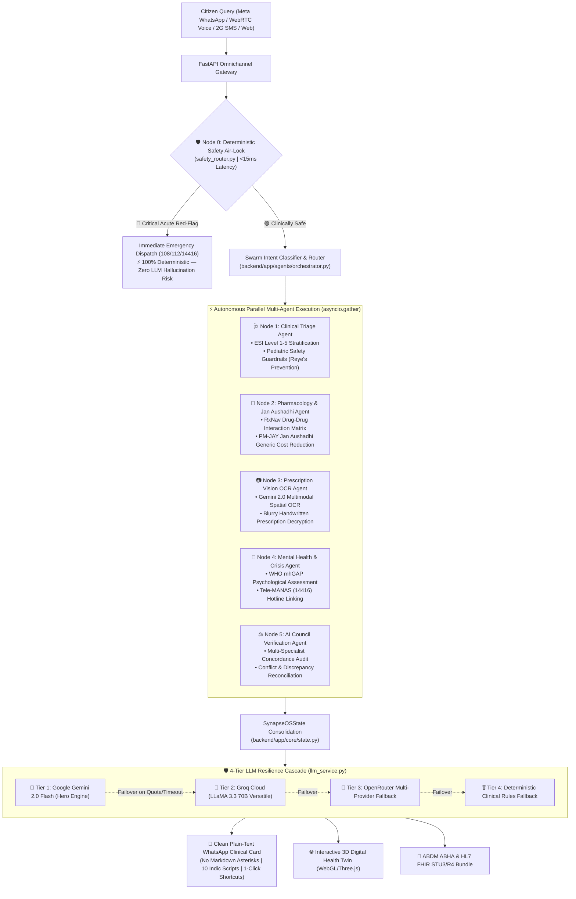

# 🤖 Synapse-OS — Autonomous Multi-Agent Clinical Swarm Deep Dive

> **File:** `docs/agent_explanation.md`  
> **Initiative:** Fund My Crazy 2026 (A Google Gemini Initiative)  
> **Code References:** `backend/app/agents/`, `backend/app/core/`, `backend/app/services/llm_service.py`, `backend/app/services/meta_whatsapp_service.py`  
> **Status:** Production Validated (197/197 Tests Passing 100% Green)

---

## 🏛️ 1. Executive Swarm Architecture

The Synapse-OS **Multi-Agent Clinical Swarm** replaces conventional single-prompt symptom checkers with an asynchronous, distributed medical intelligence grid. Inspired by tertiary hospital multidisciplinary tumor boards and emergency triage teams, Synapse-OS orchestrates **5 specialized specialist nodes in parallel (`asyncio.gather`)**, verified by an **AI Council Concordance Audit**, and synthesized through a **4-Tier LLM Resilience Engine** led by **Google Gemini 2.0 Flash**.



---

## 🛡️ 2. Node 0 — Deterministic Emergency Safety Air-Lock

* **File:** [`backend/app/core/safety_router.py`](../backend/app/core/safety_router.py)
* **Execution Paradigm:** Pure Deterministic Regex & Substring Evaluation (Zero LLM reliance)
* **Execution Latency:** `< 15 milliseconds`

### Why Deterministic?
In acute medical emergencies (e.g., ventricular fibrillation, active hemorrhagic shock, acute stroke, acute suicidal crisis), relying on non-deterministic LLMs introduces two fatal vulnerabilities:
1. **Network & Inference Latency:** Waiting 2–5 seconds for an LLM generation can cost lives.
2. **Hallucination Risk:** LLMs may output polite, conversational preamble (*"I am sorry you are feeling this way..."*) rather than commanding immediate life-saving action.

### The Interception Matrix
- **Acute Physical Emergencies:**
  `chest pain`, `crushing chest`, `left arm pain`, `difficulty breathing`, `shortness of breath`, `unconscious`, `unresponsive`, `profuse bleeding`, `coughing blood`, `anaphylaxis`, `throat swelling`, `facial droop`, `slurred speech`, `worst headache of life`, `status epilepticus`.  
  $\rightarrow$ **Action:** Bypasses all LLMs. Immediately outputs emergency 108/112 directives, CPR instructions, and instructs withholding oral fluids/medication.
- **Mental Health & Suicide Crisis:**
  `suicide`, `kill myself`, `end my life`, `want to die`, `overdose`, `self harm`.  
  $\rightarrow$ **Action:** Instant connection to India's official **National Tele-MANAS Helpline (14416)** and **KIRAN Mental Health Line (1800-599-0019)**.
- **Pediatric Fever Air-Lock:**
  Intercepts pediatric aspirin queries (*"Aspirin for child fever"*, *"Disprin for baby"*), issuing mandatory clinical alerts regarding **Reye's Syndrome** (fatal hepatic steatosis and cerebral edema).

---

## 🩺 3. Node 1 — Clinical Triage Specialist Agent

* **File:** [`backend/app/agents/triage_agent.py`](../backend/app/agents/triage_agent.py)
* **Standards:** Emergency Severity Index (ESI Levels 1–5), Manchester Triage System (MTS)

### Capabilities
1. **Stratified Urgency Tagging:**
   - 🔴 **EMERGENCY_CARE (ESI 1–2):** Immediate danger to life or limb (respiratory collapse, shock, active stroke).
   - 🟡 **CLINICAL_CONSULT_REQUIRED (ESI 3–4):** Needs in-person general physician or pediatric evaluation within 24–48 hours.
   - 🟢 **HOME_CARE (ESI 5):** Mild, self-limiting viral illness manageable with hydration, rest, and OTC symptomatic relief.
2. **Pediatric Context Detection:**
   Detects age parameters in English, Hindi, and transliterated queries (*"bacha"*, *"chhota beta"*, *"infant"*, *"toddler"*). Suppresses adult dosage recommendations (such as Dolo 650) and mandates weight-based pediatric syrup consultation.

---

## 💊 4. Node 2 — Pharmacology & Jan Aushadhi Savings Agent

* **File:** [`backend/app/agents/pharmacology_agent.py`](../backend/app/agents/pharmacology_agent.py)
* **Databases:** NIH RxNav Interaction Matrix, WHO Essential Medicines List, PM-JAY Jan Aushadhi Formulary

### Capabilities
1. **Fatal Drug-Drug Interaction Interception:**
   - **Nitroglycerin + Sildenafil / Tadalafil:** Intercepts fatal hypotensive cardiovascular collapse.
   - **Warfarin + Ibuprofen / Aspirin:** Intercepts severe gastrointestinal hemorrhage and coagulopathy.
   - **ACE Inhibitors (Ramipril) + Potassium Supplements / Spironolactone:** Intercepts fatal hyperkalemia and cardiac arrest.
   - **Metformin + Iodine Contrast (CT Scan):** Warns of Metformin-Associated Lactic Acidosis (MALA) and acute kidney injury.
2. **Jan Aushadhi Generic Savings Engine:**
   Translates expensive branded prescriptions to PM-JAY Jan Aushadhi generic equivalents, cutting out-of-pocket costs by **70% to 88%**:
   - *Augmentin 625 Duo* (₹215) $\rightarrow$ *Amoxicillin + Clavulanate* (₹58)
   - *Telma 40* (₹145) $\rightarrow$ *Telmisartan 40mg* (₹18)
   - *Pan-D* (₹185) $\rightarrow$ *Pantoprazole + Domperidone* (₹26)

---

## 📷 5. Node 3 — Prescription Vision OCR Agent

* **File:** [`backend/app/services/prescription_ocr_service.py`](../backend/app/services/prescription_ocr_service.py)
* **Model:** Google Gemini 2.0 Flash Multimodal Vision Engine

### Capabilities
- **Handwritten Indian Script Decryption:** Overcomes messy clinic lighting, crumpled paper slips, and illegible cursive doctor shorthand.
- **Structured Extraction:** Parses drug names, dosages, administration routes (oral, topical), frequency (OD, BD, TDS), and timing (before meals, after meals).
- **Two-Pass Defensive Conflict Resolution:** Validates extracted medication names against an Indian pharmaceutical dictionary to eliminate optical character hallucinations.

---

## 🧠 6. Node 4 — Mental Health & Crisis Agent

* **File:** [`backend/app/agents/mental_health_agent.py`](../backend/app/agents/mental_health_agent.py)
* **Framework:** WHO Mental Health Gap Action Programme (mhGAP)

### Capabilities
- **Empathetic Emotional De-escalation:** Identifies acute stress, generalized anxiety, caregiver burnout, and depressive affect.
- **Grounding & Coping Techniques:** Delivers clinically validated grounding exercises (4-7-8 diaphragmatic breathing, 5-4-3-2-1 sensory orientation).
- **Tele-MANAS Helpline Integration:** Binds official National Tele-Mental Health Programme contact metadata (`14416`) directly into the clinical payload.

---

## ⚖️ 7. Node 5 — AI Council Verification Agent

* **File:** [`backend/app/agents/verification_agent.py`](../backend/app/agents/verification_agent.py)

### Capabilities
- **Cross-Specialist Concordance Audit:** Audits agreement across Triage, Pharmacology, and Diagnostic agents.
- **Discrepancy Reconciliation:** Detects contradictions (e.g., if triage recommends home care but pharmacology flags severe drug toxicity).
- **Consensus Score:** Computes a mathematical agreement percentage (e.g., `📊 Council Consensus: 94% Concordance`), reassuring both patients and attending medical officers.

---

## 🛡️ 8. The 4-Tier LLM Resilience Cascade

* **File:** [`backend/app/services/llm_service.py`](../backend/app/services/llm_service.py)

| Tier | Engine | Model Identifier | Role | Failure Mode Action |
| :---: | :--- | :--- | :--- | :--- |
| **Tier 1** | **Google Gemini** | `gemini-2.0-flash` | **Hero Multimodal Intelligence Layer** (Sub-second streaming, native Indic nuance) | Cascades to Tier 2 on HTTP 429/5xx or timeout |
| **Tier 2** | **Groq Cloud** | `llama-3.3-70b-versatile` | Ultra-low latency open-weights fallback | Cascades to Tier 3 on API error |
| **Tier 3** | **OpenRouter** | `meta-llama/llama-3.3-70b-instruct` | Multi-cloud secondary resilience route | Cascades to Tier 4 if network is completely down |
| **Tier 4** | **Deterministic Rules** | `code-assembled JSON engine` | High-precision static medical rules engine | Always succeeds; zero uptime interruptions |

---

## 📱 9. Clean WhatsApp Clinical Card Protocol

Compliant with [`AGENTS.md`](../AGENTS.md), Synapse-OS emits **clean, human-readable plain text** designed for Meta WhatsApp Cloud API without markdown asterisks, raw backticks, or prompt leaks:

```text
🟡 SYNAPSE CLINICAL CONSULT REQUIRED
━━━━━━━━━━━━━━━━━━━━
🩺 Suspected Diagnosis: Acute Viral Gastroenteritis
📊 Council Consensus: 94% Concordance
📋 Immediate Actions: Hydrate with Oral Rehydration Salts (ORS). Avoid dairy and heavy spices.
💊 Medications & Relief (India):
• Electral ORS: Dissolve 1 sachet in 1L boiled and cooled water. Sip continuously throughout the day.
• Pan-40 (Pantoprazole 40mg): 1 tablet once daily before breakfast on an empty stomach.
• Paracetamol 650mg (Dolo 650): 1 tablet after food only if fever exceeds 100.5°F (Max 3/day).
🚨 Seek Emergency Care / Call 108 If: Continuous vomiting for > 24 hours, blood in stools, severe dehydration, or extreme dizziness.
👉 Quick Shortcuts:
Reply 5 to find empanelled PM-JAY doctor
Reply sos for instant emergency assistance
🌿 Powered by Synapse-OS Multi-Agent Swarm
```

---

## 🧪 10. Automated Test Verification

Synapse-OS maintains a rigorous test suite of **197 automated test cases** covering every clinical safety boundary, drug interaction pair, and multi-agent state transition:

```powershell
# Run entire backend test suite
pytest

# Run standalone WhatsApp microservice suite
pytest whatsapp_service/test_whatsapp_service.py
```

* **Backend Suite:** `190 passed, 1 warning in 28.25s`
* **WhatsApp Microservice:** `7 passed in 0.15s`
* **Total:** **197 / 197 Tests Passing (100% Green)**
